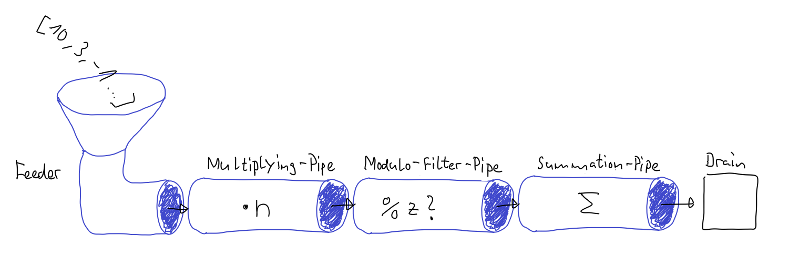
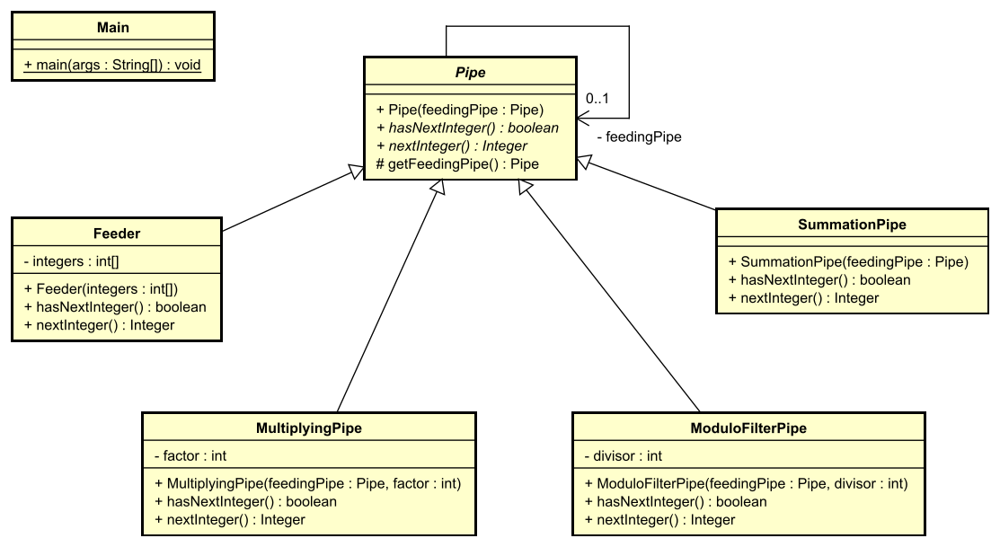

# Integer Pipes
Pipes are objects, which can be attached to each other, thus forming a cascade of pipes. Data can be fed on one side of the pipe cascade. While the data flows down the pipes, it is processed by the individual pipe objects and finally can be gathered at the draining end of the cascade. 

The data flow through the pipe cascade can be controlled either from the **feeding** end (front end) or from the **draining** end (back end). In the first case, the object at the **front end** provides methods to feed one or more data elements to the pipe cascade. A call to such a method at the front starts a cascade of further method calls **downwards** the pipe cascade and finally ends in a last method call at the back end of the cascade. This last method is then responsible for the final handling of the processed data, e.g. writing it to some device.

In the second case, the object at the **back end** of the cascade provides methods to fetch one or several processed data elements from the pipe cascade. A call to such a method at the back end starts a cascade of further method calls **upwards** the pipe cascade, finally ending in a last method call at the front end of the pipe cascade. This last method call fetches a new data element e.g. from a pool, where the not yet processed elements are stored (e.g. an array). It is also possible, that the front end is endlessly producing new data elements.

The second approach is often combined with a technique called **lazy evaluation**, which means that data is only processed when it is required and methods are only called when necessary.

In this task you will implement such a pipe processing system for integer values, using the second approach. By doing this you will get an idea how **java streams** work (java streams are topic of the module **Programming 2**).

## Class Diagram
You shall implement the classes conforming to the following class diagram. The shown classes and methods are mandatory. However, you may add additional private methods and attributes / instance variables.

## Class Descriptions

### Abstract Class `Pipe`
This is the abstract base class for all pipes. It knows its feeding `Pipe` object. This must be provided to the constructor. The final protected method `getFeedingPipe` returns a reference to the feeding `Pipe` object.

The class declares the following abstract methods:
1. `hasNextInteger()`   
Returns `true` if there are more integer numbers ready to be fetched from this pipe. It returns false, if there are no more integer numbers available. Implementations typically will consult the feeding pipe object to response calls to this method.
1. `nextInteger()`.   
Returns either the next integer number, or `null` if there is no more number available. Implementations typically will consult the feeding pipe object to response calls to this method.

### Class `Feeder`
An object of the final class `Feeder` is the front end of a pipe cascade. It can be load with an array of integers upon construction. It feeds the integers to the connected pipe (one per call of the method `nextInteger()`). The instance variable `integers` shall be final.

### Class `MultiplyingPipe`
A final pipe class, which multiplies the transfered integer numbers by a fixed `factor`. The factor must be provided to the constructor and shall be final.

### Class `ModuloFilterPipe`
A final pipe class, which applies a modulo operation to each transfered integer number and only lets pass numbers, where the result of the modulo operation is 0. The `divisor` for the modulo operation must be provided to the constructor and shall be final.

### Class `SummationPipe`
A final pipe class, which sums up all integer numbers fetched from the feeding pipe object. The sum is calculated and returned upon the first call to the method `nextInteger()`, given there are any integer numbers available from the feeding pipe. Otherwise `null` is returned.

In any case further calls to `nextInteger()` will result in a `null` return value.

## Testing
You may use the `Main` class to run an example configuration of an integer pipe cascade to get impression of the running system.

Validate your implementation against the JUnit test cases.

